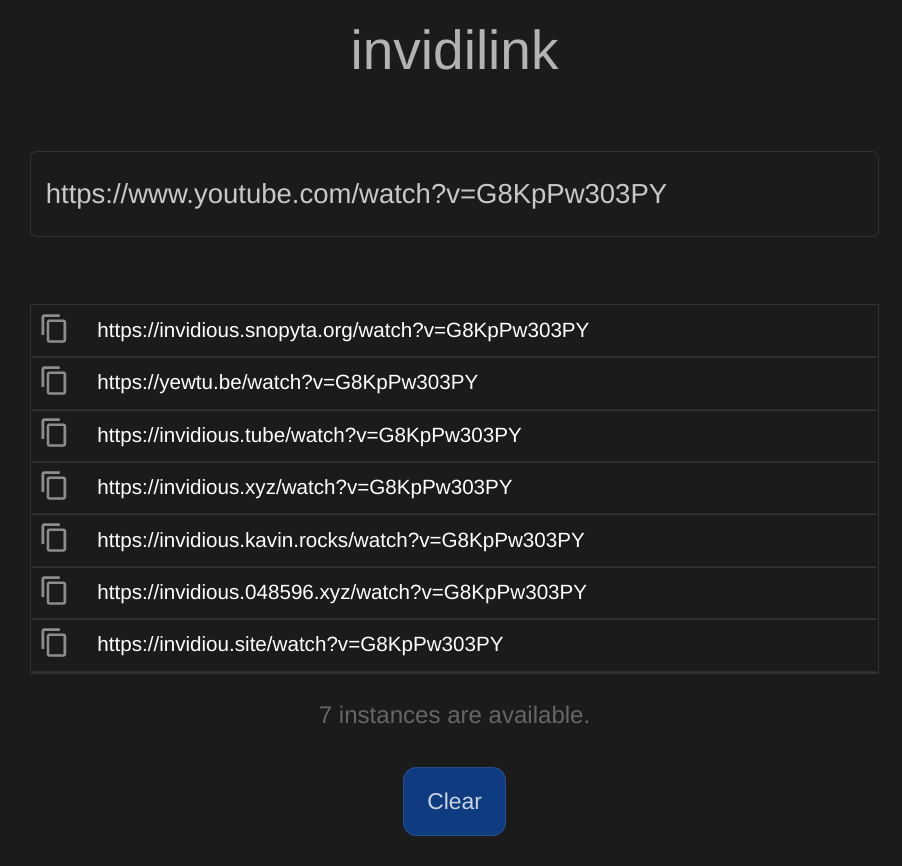

# invidi.link

[](https://builds.sr.ht/~djlooop/invidi.link?)

Invidilink is a mobile-first React app to replace URLs with valid invidio.us (invidious.io) instances URLs.

Ideal for mobile use when somebody posts a youtube link or when one or more invidious instances are experiencing performance issues and a substitute is desired.

For example:

Submitted URL: `https://www.youtube.com/watch?v=sbFAcHteZd8`

Sample Results:

-   `https://invidious.snopyta.org/watch?v=sbFAcHteZd8`
-   `https://invidious.tube/watch?v=sbFAcHteZd8`
-   `https://yewtu.be/watch?v=sbFAcHteZd8`
-   `https://invidious.xyz/watch?v=sbFAcHteZd8`
-   `https://invidious.kavin.rocks/watch?v=sbFAcHteZd8`
-   `https://invidiou.site/watch?v=sbFAcHteZd8`

Features a copy button for easy use on mobile.

Additionally, provide a "url" parameter to pre-populate the form:

https://invidi.link/?url=https://www.youtube.com/watch?v=iRXJXaLV0n4

In the wild: https://invidi.link/



### How it works

invidilink uses monitor data provided by invidious.io to determine which instances are successfully serving videos. The list is populated once
per user session.

### Privacy

invidilink is GPL licensed. No third-party trackers are used and no
URL data is sent to the server.

### Contributing

If you would like to contribute, please submit a PR.

## Installation

It is recommended to use a local endpoint for development testing.

The endpoint is set in api-config.js.

### How to run on localhost

First install dependencies:

```sh
npm install
```

To run in dev mode mode:

```sh
npm start
```

Then go to http://localhost:8080

To create a production build:

```sh
npm run build
```

### Testing

To run unit tests:

```sh
npm test
```
